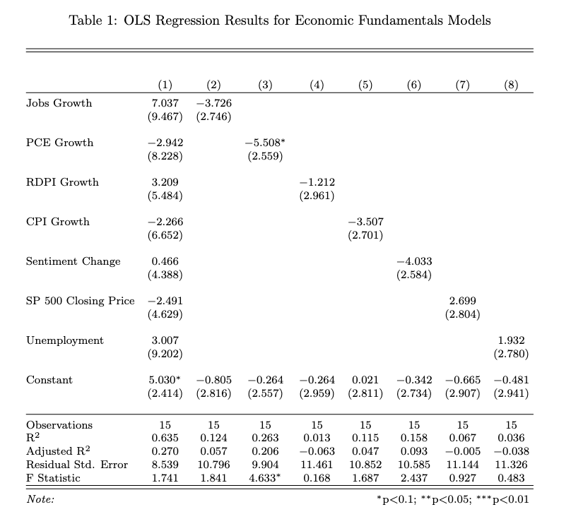

# Overview

This week, I will expand the predictive model for the 2024 presidential election that I developed last week. In my previous model, I used the "partisan lean index" (PLI) --- which measures the difference between the state's democratic two-party vote share and the two party democratic vote share nationwide, and includes adjustments for home state advantage and state-level population density --- in the previous two election cycles to predict the electoral college results for the current election cycle.

Last week's model had a number of limitations. First, the outcome variable I was predicting --- two party vote share in each state --- does not actually determine who wins the state electors. Unfortunately, as much as I wish the likes of Jill Stein, Ralph Nader, and Cornell West didn't clutter up the ballot, the truth is that these third-party candidates, while rarely garnering more than a small fraction of the vote in any particular state, can have huge impacts on the overall state-wide election result. Consequently, this week, I plan to predict not two party vote _share_, but two party vote _margin_, a metric that a third-party candidate cannot distort.

Second, my previous forecast attempted to predict vote share in a single step using the PLI from the 2020 and 2016 elections. This time, I will add an intermediate step and use the 2020 and 2016 PLIs to forecast the 2024 PLI. Then, I will use the 2024 PLI, along with a multitude of other variables, to actually predict vote margin. This two-stage approach has two advantages. First, it allows me to more seamlessly integrate polling data later down the line, because I can easily create a national "snapshot" of the election by adding the PLI to the most current polling data that provides the nationwide vote margin. Second, it allows me to disaggregate the "politics" portion of the model from the "fundamentals" portion of the model. These two portions will then coalesce to produce my final prediction of vote margin.

Third, I improve my adjustments to the "partisan lean index." Now, I scale the home state advantage and resident state advantage adjustments by the size of the state, which is meant to capture the fact that candidates from smaller states tend to see larger effects. I also include a term that measures a state's elasticity, which captures the degree to which a given state "swings" from cycle to cycle. This adjustment only includes data from the 2008, 2012, 2016, and 2020 elections in order to most accurately capture the current political climate.

Fourth, I include the fact that Maine and Nebraska split their electoral votes. They each allocate two electoral votes to the winner of the state's popular vote. Then, they allocate one electoral vote to the popular vote winner in each congressional district. Thus, in total, my forecasts predicts vote margin in 54 jurisdictions: the two congressional districts in Maine, the three congressional districts in Nebraska, the other 48 states, and Washington D.C.

Finally, and most importantly, I construct from scratch the "fundamentals" forecast using the following six economic indicators:
* Total non-farm jobs
* Personal consumption expenditure
* Real disposable personal income
* Inflation, as measured by the annual change in the Consumer Price Index
* The stock market, based on the closing value of the S&P 500 
* The consumer sentiment index calculated by the University of Michigan
Each variable in the above set serves a particular function.
* The unemployment rate

_Jobs._ Total non-farm jobs typically reflect overall employment health, with more jobs typically signaling economic growth, which can benefit the incumbent.

_Personal Consumption Expenditure._ Expenditure data helps measures consumer spending, a key indication of economic vitality. If the economy is strong, consumers spend more on goods and services that they might otherwise forego. This metric is a key indicator for aggregate demand.

_Real Disposable Personal Income._ Like personal consumption expenditure, real disposable personal income also measures the financial health of the consumer. However, rather than only measuring the total amount of money spent, RDPI measures the total amount of money earned, some of which the consumer will be able to save. 

_Inflation._ Unlike job growth, which primarily affects those not already in a job, inflation affects everyone, because it affects the cost of living. Higher inflation reduces voters' purchasing power. In particular, due to a combination of the government's aggressive fiscal policy response to the COVID pandemic and a series of exogenous supply shocks, inflation skyrocketed during 2021 and 2022. Now, when people are surveyed about the economy, their primary concern is rising prices, inflation, and high cost of living ([Pew Research Center (2024)](https://www.pewresearch.org/politics/2024/05/23/publics-positive-economic-ratings-slip-inflation-still-widely-viewed-as-major-problem/), [Stantcheva (2024)](https://www.nber.org/papers/w32300)).

_Stock market._ The stock market --- specifically the closing value of the S&P 500, the largest 500 companies listed on the New York Stock Exchange --- serves as a proxy for economic optimism, particularly among wealthier voters and investors. Unlike the other economic indicators which typically reflect how voters are feeling about the economy as a whole, and therefore their views of the incumbent president, part of the stock market's predictive power comes from investors who are actively attempting to find trades projected to shoot sky-high in the event that one candidate or another comes to power. 

_Consumer Sentiment._ Recently, consumer sentiment about the economy --- i.e. how people think the economy is doing --- is drastically different from the actual state of the economy ([Radcliffe et. al. (2024)](https://abcnews.go.com/538/vibes-americans-perception-economy-completely-changed/story?id=111211869)). There are many explanations for this "sentiment gap." Perhaps its because of the recent interest rate hikes that increase the cost of borrowing ([Summers et. al. (2024)](https://www.nber.org/system/files/working_papers/w32163/w32163.pdf)) Perhaps it's because the period from February 2021 to June 2022 was the first time consumers in the United States experienced prolonged high levels of inflation since the 1990s, after the oil price shock in response to Iraq's invasion of Kuwait. Regardless, this divergence suggests that traditional economic indicators may not entirely capture voters' underlying  behavior, because they may have a warped understanding of the economy. I thus include the "Index of Consumer Sentiment," aggregated from a University of Michigan survey.

_Unemployment._ Unemployment measures the percentage of the labor force that is actively seeking work but unable to find it. The unemployment rate also providing insight into labor market inefficiencies that total non-farm jobs do not capture. While job growth reflects the overall number of positions added to the economy, unemployment highlights the share of people left behind.


# Methodology

Now, let's get into the weeds of the methodology. Much of my work this week was compiling and aggregating many different variables into a full election history that we will include in future regression analyses.

First, I created a set of variables that measure incumbency. The "incumb" variable equals `\(1\)` if the democratic candidate is an incumbent, `\(-1\)` if the republican candidate is an incumbent, and `\(0\)` otherwise. The "incumb_party" variable equals `\(1\)` if the democratic party controlled the White House during the previous election cycle and `\(-1\)` if the republican party controlled the White House. There is also an indicator that measures whether or not the candidate served in the previous administration.

Second, I created a set of variables that measure "home state advantage." Home state advantage refers to the boost that candidates receive from their home states simply by virtue of having lived there. Actually, I split up home state advantage into pure home state advantage (where the candidate was born) and resident state advantage (where a candidate lived at the time of the election). Furthermore, the magnitude of the advantage is inversely proportional to the size of the state ([Beck & Rice (1983)](https://www.jstor.org/stable/2110984?seq=6)). Thus, to compute the size of the home state advantage, I first merged in data on the population of the 50 states and Washington D.C. from the United Census Bureau. (Totals for each year are calculated via linear imputation from the decennial census. I was unfortunately unable to find population data for the districts in Nebraska and Maine, though it is not an issue given that no presidential candidates have been from either of those two states.) Then, I normalized the population to a scale from `\(0\)` to `\(1\)` --- a process known as min-max normalization or feature scaling --- where `\(1\)` represents the most populous state and `\(0\)` represents the least. The variables for home state advantage and resident state advantages were then computed by multiplying these normalized population totals by an indicator that equals `\(1\)` if the democratic candidate is from that state, `\(-1\)` if the republican candidate is from that state, and `\(0\)` otherwise.

Third, I created a variable that measures the elasticity of a given state, which reflect how much a state's vote margin would change based on a 1 point swing in the national margin. The idea of "elasticity" comes from economics, where we are typically quite interested in the sensitivity of either demand or supply to a small change in the price of a good. For  continuous functions, elasticity can be calculated as:
$$ \epsilon = \frac{\partial q}{\partial p} \cdot \frac{p}{q}$$
But in the descrete case, we can calculate elasticity as:
$$ \epsilon = \frac{\Delta m_{t,t-1}}{\Delta n_{t,t-1}}$$
where `\(m_{t,t-1}\)` represents the change in state-level vote margin from period `\(t-1\)` to period `\(t\)`, and `\(n_{t,t-1}\)` represents the same for national-level vote margin.

The final interesting methodological choice involves the method of aggregating all the economic indicators. The Bureau of Labor Statics and the St. Louis Federal Reserve are fantastic because they provide monthly data for most of the important indicators, such as jobs, unemployment, and so on. Unfortunately, elections occur once every four years, which means that, for each index, I somehow need to distill four years worth of fluctuation for each economic indicator into a single data point. This method of aggregation is more important than one might initially think. For example, it would be a poor forecast for the 2024 election if I only included economic data that reflected the COVID crisis.

The aggregation process proceeded in two steps. To start, I actually disaggregated the indicator for the S&P 500 closing price. Unfortunately, I wasn't able to find a monthly time series for this (could it potentially be in our future @Matthew?), so I assumed that the closing price for each of the three months of a given quarter was simply equal to that quarter's average closing price. Then, I wrote three separate aggregation functions. The first function, which I coin "rate aggregation," measures the percent change of a given economic indicator between period `\(t_1\)` and period `\(t_2\)`, measured in the number of months in the election cycle before the election, with `\(-47 \leq t_1, t_2 \leq 0\)` as parameters that must be manually manipulated during model training. The second function does the same thing, but takes the average value of the indicator in that time period. The third function calculates the percent change of the indicator, then subtracts off the average percent change of the indicator for all periods of length `\(t_2 - t_1 + 1\)` in that election cycle. In other words, `\(5\%\)` job growth in the period before the election seems great, but it might be terrible compared to the `\(10\%\)` job growth throughout the two years prior.

Once I aggregated all the economic indicators, I then standardized them, roughly matching moments (means and variances).

Finally, we are ready for the regressions. Remember, for the electoral college predictions, I run three regressions in sequence. The first regression predicts the current year's elasticity from the previous years:
$$
\epsilon = \beta_0 + \beta_1 \epsilon\_lag1 + \beta_2 \epsilon\_lag2 + \mu + \varepsilon
$$

The second predicts the current year's partisan lean from previous years, incorporating adjustments based on home state advantage, resident state advantage, and the elasticity of a given state:
$$
\mathrm{pl} = \beta_0 + \beta_1 \mathrm{pl\_lag1} + \beta_2 \mathrm{pl\_lag2} + \beta_3\mathrm{hsa} + \beta_4\mathrm{rsa} + \beta_5\mathrm{\epsilon} + \mu + \gamma + \varepsilon
$$

Then, finally, the partisan lean for a given year is incorporated into the vote margin forecast:
$$
\mathrm{margin} \cdot \mathrm{incumb} = \beta_0 + \beta_1\mathrm{pl} + \beta_2 \mathrm{jobs} + \beta_3 \mathrm{pce} + \beta_4\mathrm{rdpi} + \beta_5\mathrm{cpi} + \beta_6\mathrm{ics} + \beta_7\mathrm{sp500} + \beta_8\mathrm{unemp} + \mu + \gamma + \varepsilon
$$

Unfortunately, I did not have time to implement the full electoral college prediction this week, which means I was not able to optimize the model above. As a result, I settled for predicting the national vote margin with economic fundamentals alone and no additional term for the partisan lean of a state:

$$
\mathrm{margin_{nat}} \cdot \mathrm{incumb} = \beta_0 + \beta_1 \mathrm{jobs} + \beta_2 \mathrm{pce} + \beta_3\mathrm{rdpi} + \beta_4\mathrm{cpi} + \beta_5\mathrm{ics} + \beta_6\mathrm{sp500} + \beta_7\mathrm{unemp} + \mu + \gamma + \varepsilon
$$
There are a few important things to note about the above regressions specifications. First, notice that the vote margin is multiplied by the incumbent dummy. This is because margin is positive when a democrat wins, and negative when a republican wins. the "incumb" variable is positive if a democrat is the incumbent and negative if the republican is the incumbent. We want to use economic conditions to predict the size of the margin favorable to the incumbent, which means we need to multiply the two outcome variables to cancel out partisan effects.

Second, notice that there are two terms at the end of the regression before the error term. These terms represent state and year fixed effects respectively. These variables help to control for unobserved heterogeneity, ensuring that certain inherent characteristics of states or specific election years --- political culture, demographic composition, and so on --- that might affect the outcome are accounted for. Functionally, these fixed effects operate by creating dummy variables for every state and every year.





```
## [1] 236.8583
```

```
## [1] 204.2256
```

}}index_files/figure-html/unnamed-chunk-3-1.png" width="672" />

```
## integer(0)
```


