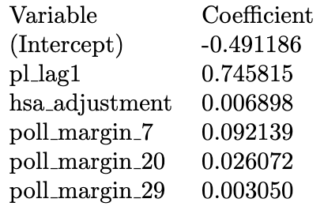
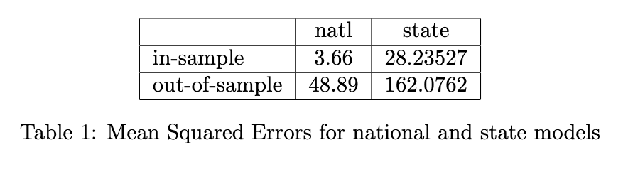
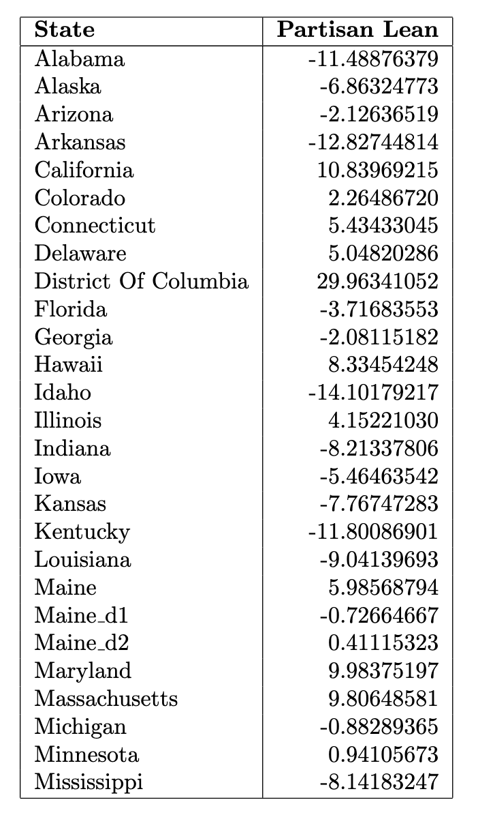
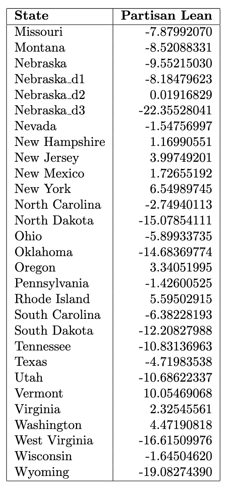

# Overview

Last week, I developed a comprehensive structure that can be used to build a model that combines the fundamentals with a current snapshot of the political climate in order to forecast the electoral college. The model proceeded in three steps:
1. Forecast each state's elasticity, which represents the change in state-level vote margin between two election cycles. This metric measures the "swinginess" of a state.
2. Forecast each state's partisan lean, which measures the extent to which a state is either more democratic or more republican than the national popular vote.
3. Using national indicators, forecast the two-party vote margin. Then, add the partisan lean predictions to the national margin forecast to get each state's true outcome.
This approach is my best interpretation of the methodology [articulated by 538 back in 2020](https://fivethirtyeight.com/features/how-fivethirtyeights-2020-presidential-forecast-works-and-whats-different-because-of-covid-19/).

Previously, my forecasts only included autoregressive components, home state advantage, and economic indicators. This week, I add in historical polling data from 538 (going back to 1968) and presidential approval ratings from Roper (going back to 1948) at both the state and federal level. Once again, much of the week was spent cleaning and merging this data, which meant that I have not yet had time to optimize the model. For example, I was not yet able to correct the polling data for the convention bounce or apply likely voter or house effects adjustments. I was, however, able to put together a full forecast of the electoral college --- albeit one that is clearly flawed.


# Methodology

Most of my polling data comes from 538's historical polling averages. These averages --- at least in recent years --- also include 538's ratings for each pollster on a scale from zero to three. When I aggregated the polls, I gave more emphasis to stellar polls like the New York Times/Siena poll. To incorporate the traditional polling data, which measures the percentage of the electorate that supports a given candidate, I created a distinct variable that measured the poll margin (percent supporting the Democrat minus the percent supporting the Republican) for each week in the 250 days before the election. One set of these 36 variables measured the national poll margin, and one set of 36 variables measured the state-level poll margin.

To incorporate the polling data on the president's approval rating, because so much data was missing, I took a different approach, instead attempting to aggregate the time series into a single score that measures the president's approval during the election year. To do this, I used an exponential decay function to up-weight presidential approval measurements more recent to the election and down-weight presidential approval measurements that were taken many months before election day. This function takes the form `\(a = e^{-kw}\)`, where `\(a\)` is the approval rating, `\(w\)` represents the number of weeks prior to the election, and `\(k\)` represents the decay factor. I used a decay factor of 0.01, which gives polls from about 2-3 months prior to the election roughly half the weight of the polls taken on election day. A similar version of exponential weighting is described [here](https://fivethirtyeight.com/methodology/how-our-polling-averages-work/).

Now let's take a look at the updated regression specifications.

_Forecast #1_. Not much changed here:

`$$\epsilon = \beta_0 + \beta_1 \epsilon\_lag1 + \beta_2 \epsilon\_lag2 + \varepsilon$$`

_Forecast #2_. Added variables for each week's state level polling average (represented by the matrix `\(\chi\)`):

$$
\mathrm{pl} = \beta_0 + \beta_1 \mathrm{pl\_lag1} + \beta_2 \mathrm{pl\_lag2} + \beta_3\mathrm{hsa} + \beta_4\mathrm{rsa} + \beta_5\mathrm{\epsilon} + \vec{\beta_6}\chi + \varepsilon
$$

_Forecast #3_. Added variables for each week's national polling average as well the incumbent president's approval rating for the election cycle:

$$
\mathrm{margin} \cdot \mathrm{incumb} = \beta_0 + \beta_1\mathrm{pl} + \beta_2 \mathrm{jobs} + \beta_3 \mathrm{pce} + \beta_4\mathrm{rdpi} + \beta_5\mathrm{cpi} + \beta_6\mathrm{ics} + \\
\beta_7\mathrm{sp500} + \beta_8\mathrm{unemp} + \beta_8\mathrm{approval} + \vec{\beta_{10}}\chi + \varepsilon
$$
Unlike last week, I did not include either state fixed effects or year fixed effects in my model due to a bug that occurred when I added so many dummy variables.

Models two and three were both _elastic net regressions_, which means that they incorporated regularization techniques used to select the most important and most predictive features. Given that my prediction matrix contains substantially more columns than it does rows (we only have data for the past 18 presidential elections), regularization is necessary both to generate a solution for the regression and to prevent overfitting.

Elastic net regression combines Lasso regression, which adds an L1 penalty to the OLS optimization, and Ridge regression, which adds an L2 penalty. The balance between Lasso and Ridge is controlled by a mixing parameter, `\(\alpha\)`, which I set to `\(0.5\)`. In future iterations of my model, this parameter will need to be further optimized.

# Results

The table below reports the the coefficients of the model for the national vote-margin forecast. As you can see, the elastic net shrunk a large majority of the coefficients to zero, particularly the polling margin data taken long before election day. Most of the economic fundamentals remained in the model, except for unemployment and personal consumption expenditures, which disappeared likely because it is so highly correlated with real disposable personal income.


And here are the results from the partisan lean forecast at the state-level. As with the national forecast, the partisan lean forecast also shrunk many of the poll margin variables, as well as the resident state advantage adjustment, entirely to zero.



For each of the models, I also ran leave-one-out cross validation, like last week, in order to get both the in-sample and out-of-sample mean squared errors.



And then I used the model to make predictions for both the 2024 national popular vote margin and the 2024 partisan lean of each state. My model predicts that Trump will win the popular vote by `\(2.5\)` points. Here are the partisan leans for each state: 





Here is the graph of the in-sample predictions and the actual values for the national popular vote margin model:

}}index_files/figure-html/unnamed-chunk-10-1.png" width="672" />

```
## integer(0)
```


Clearly, there is something seriously wrong with these two models. For one, the in-sample MSE is significantly smaller than the out-of-sample MSE, which suggests overfitting. Futhermore, in the national model, the national poll margin variables seem to be _negative_ predictors of the true national vote margin, which doesn't really make sense. These variables should be highly correlated with the outcome, because if a candidate is polling well, they should be more likely to win.

In addition, the state level model for partisan lean shrinks variables that likely should not disappear. For example, many previous forecasters have indicated that the partisan lean of a given state is (roughly) a linear combination of its partisan lean in the two previous election cycles. Thus, it doesn't make sense for the elastic net to shring the `\(\mathrm{pl_lag2}\)` variable entirely to zero.

Next week, I will begin my analysis by exploring these issues, and I will make sure to provide a prettier visualization of the electoral college results!
