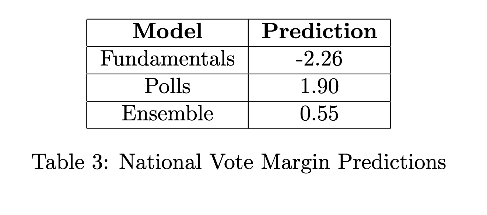
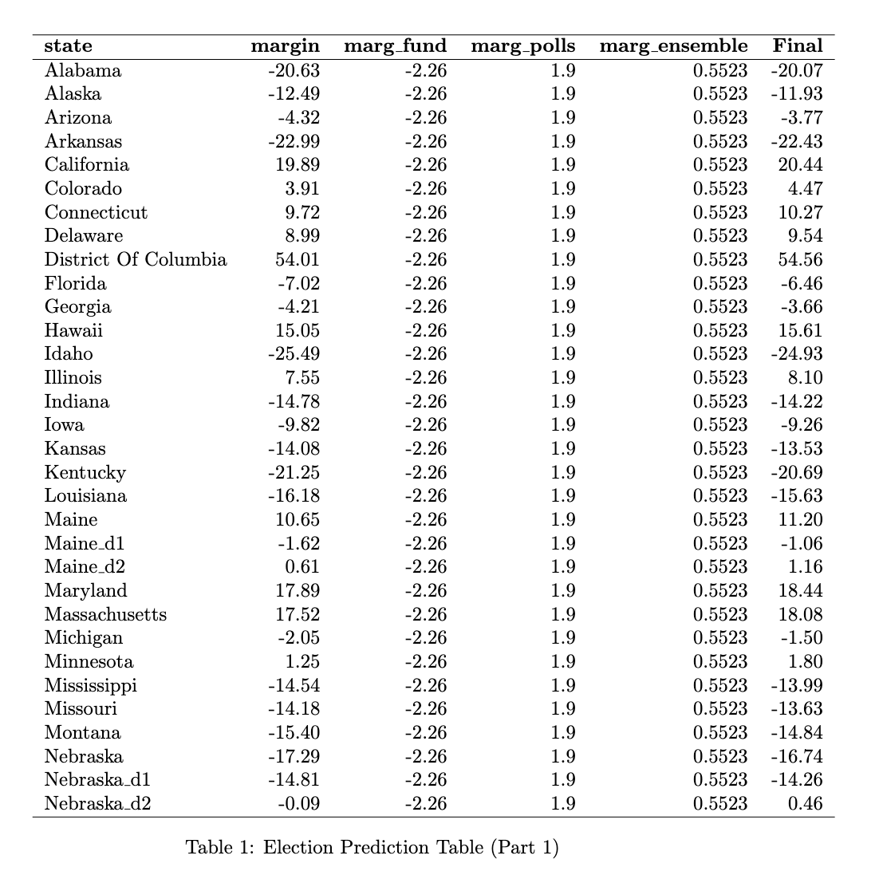
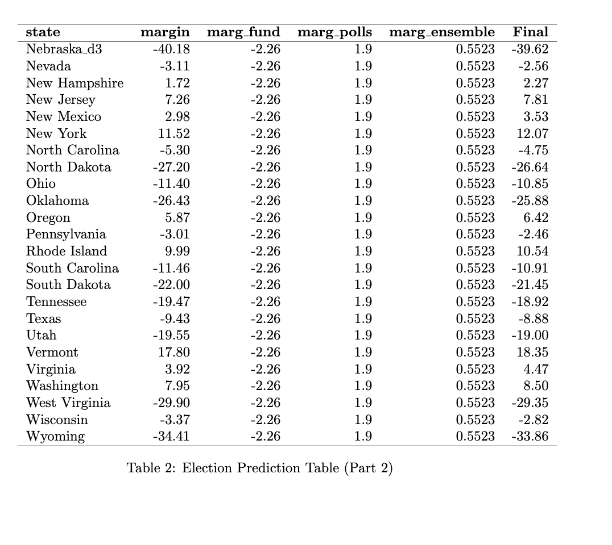

# Overview

This week, I plan to take a step back and fully refine and optimize my model that I have created over the past few weeks. I will only include a single new source of already clean data --- the Cook Political Report expert ratings --- which means that I plan to devote the full post to code and methodological improvements.

As a reminder, my current model proceeds in three steps. First, I fit a model to predict each state's elasticity based on its elasticity in the previous two election cycles. Then, I train a model to predict each state's partisan lean, which incorporates the predicted value for elasticity. Finally, I train a separate model on national level data to predict the national vote margin.

This framework one big flaw. First of all, it doesn't distinguish between the relative importance of polling data --- which creates a snapshot of the political climate --- and fundamentals data. The reason for this is that both polls and fundamentals are simultaneously incorporated as independent variables in the model that predicts a state's partisan lean and the model that predicts the national popular vote margin.

To fix this issue, I will deploy a technique called ensemble learning, which lets me train multiple models to predict the same outcome variable, and then compute the weighted average of these multiple predictions that best minimizes out-of-sample error. Ensemble learning will allow me to split up the forecasts into separate fundamentals-based forecasts and polling-based forecasts.

In addition to the structural flaw with my previous approach, there were also a few implementation errors that likely affected my predictions:

First, partisan lean was calculated incorrectly. Previously, I defined it as the difference between the state-level popular vote and the national-level popular vote. However, this is a mistake. If my goal is truly to predict both state- and national-level vote _margin_, then partisan lean should measure the difference between the state-level popular vote _margin_ and the national-level popular vote _margin_. 

To see the difference between the two, consider the following example. In 2020, Biden won the popular vote 50.3 to 46.9, and he won Pennsylvania 50.0 to 48.8. Thus, the national margin is +3.4, and the Pennsylvania margin is +1.2. Previously, I calculated Pennsylvania's partisan lean by calculating the difference in the popular vote: `$$\mathrm{pl_{wrong}} = 50.0 - 50.3 = -0.3$$`. However, a better metric would be to calculate the difference in the popular vote margins: `$$\mathrm{pl_{correct}} = 1.2 - 3.4 = -1.2$$`

Second, in a similar vein, state-level polling --- which is fundamentally a survey that tries to guess the state's popular vote --- is not a good predictor of partisan lean. Rather, I should calculate the "polling lean," which would calculate the difference between the state level poll margin and the national level poll margin, just as the partisan lean of a state calculates the difference between the actual vote margins at the state and national level.

Third, recall that in my last blog post, I noticed that the national poll margin variables seemed to be _negatively_ correlated with the true national vote margin --- a very odd occurrence indeed. I realized that this issue likely arose because I was training the national polling margins, which are positive if the Democrat is winning and negative if the Republican is winning, on the product of the incumbency indicator and the true national vote margin, an interaction term that is positive if the incumbent is winning and negative if the challenger is winning. This discrepancy means that the national polling margins were likely being trained on the entirely wrong outcome!

In addition to correcting these fixes, I also spend time further optimizing and tuning the hyperparameters in my model. For example, I attempt to optimize alpha, the mixing parameter that helps determine whether I prioritize a Ridge penalty or a LASSO penalty when implementing regularization.

# Methodology

This week, we have the following regressions:

$$
\mathrm{pl} = \beta_0 + \beta_1 \mathrm{pl\_lag1} + \beta_2 \mathrm{pl\_lag2} + \beta_3\mathrm{hsa} + \beta_4\mathrm{rsa} + \beta_5\mathrm{\epsilon} + \vec{\beta_6}\chi + \varepsilon
$$
$$
\mathrm{margin\_nat} = \beta_0 + \mathrm{incumb} \cdot (\beta_1\mathrm{pl} + \beta_2 \mathrm{jobs} + \beta_3 \mathrm{pce} + \beta_4\mathrm{rdpi} + \beta_5\mathrm{cpi} + \beta_6\mathrm{ics} + \beta_7\mathrm{sp500} + \beta_8\mathrm{unemp}) + \varepsilon
$$

$$
 \mathrm{margin\_nat} = \beta_0 + \beta_1 \mathrm{incumb} \cdot \mathrm{approval} + \vec{\beta_{2}}\chi + \varepsilon
$$
Notice that the incumbency indicator is much more carefully interacted with the various predictors --- it only is interacting with the variables are positive for the incumbent and negative for the challenger. (Sidenote: incumb here refers to incumbent party, which is explained in last week's blog post.) In addition, in the first model, the matrix `\(\chi\)` now refers not to poll margins, but rather poll _lean_, as articulated above.

Notice that we split up the predictions for the national vote into two. That is because we implement something called stacking, where we train a meta model using the predictions from the two models above. For the sake of simplicity, I will call the first model for national margin the "fundamentals model" and the second model for national margin the "polls model."

There are many ways we can combine our predictions from these two models. Most simply, we could average the two:

$$
\mathrm{pred\_final} = \frac{1}{2} \left(\mathrm{pred\_fundamentals} + \mathrm{pred\_polls}\right)
$$
Alternatively, we could adopt the hypothesis of Gelman and King (1993) that the fundamentals matter more as we get closer to November, or Nate Silver's claim that polls matter more as we get closer to November. Of course, all these are estimates, and it doesn't make much intuitive sense to set these weights manually in such an arbitrary way.

So, I trained a model to figure out the weights for me:
$$
\mathrm{margin\_nat} = \beta_0 + \beta_1 \mathrm{pred\_model\_1} + \beta_2\mathrm{pred\_model\_2} + \varepsilon
$$
Which gave the following output:


```
## 
## Call:
## lm(formula = y ~ ., data = meta_features)
## 
## Coefficients:
## (Intercept)      model_1      model_2  
##      0.9444       0.8113       0.7607
```
In other words, the fundamentals have a slightly higher weight than the polls do. Now, I'm not sure I agree with this, and we'll see soon just how much tinkering with the weights matter. Oh, and one last thing before I move on to the hyperparameter tuning: the weights do _not_ have to sum to one. The regression is simply trying to minimize the prediction error, and the resulting weights represent how much each base model contributes to the final prediction. These weights are not probabilities and are not constrained in any specific way.

Finally, I spent a lot of time trying to figure out how to tune the regularization hyperparameters. Recall that we compute our vector of coefficients, `\(\hat{\beta}\)`, as follows: 
$$
\hat{\beta} = \mathrm{argmin}\left\{E(y - \vec{x}\cdot\vec{b})^2 + \lambda\sum_{j = 1}^{k}\left[(1 - \alpha)b_j^2 + \alpha |b_j| \right]\right\}
$$

where the expectation calculates the mean squared error --- the squared distance between the actual output and the predictions --- and the term in the sum is a penalty term that shrinks each coefficient. The elastic net penalty is controlled by `\(\alpha\)`, and determines the best mix of LASSO regression ( `\(\alpha = 1\)` ) and ridge regression ( `\(\alpha = 0\)` ). The tuning parameter `\(\lambda\)` controls the overall strength of the penalty.

To optimize these two simultaneously, I developped the following algorithm:
1. Split the data into a training subset ( `\(\mathrm{year} < 2024\)` ) and a testing subset ( `\(\mathrm{year} == 2024\)` ).
2. Create a three dimensional matrix to search for both alpha and lambda simultaneously. The first dimension is for each value of `\(\alpha\)` from `\(\alpha_{min}\)` to `\(\alpha_{max}\)`. The second dimension is for each value of `\(\lambda\)` from `\(\lambda_{min}\)` to `\(\lambda_{max}\)`. (I set `\(0 \leq \alpha \leq 1\)` and `\(0 \leq \lambda \leq 5\)`.) The third dimension is for each year I left out during cross validation. 
3. Loop over each combination of `\(\alpha\)` and `\(\lambda\)`. Perform leave-one-out cross-validation for each year.
a. Train the elastic net model on the data excluding the K-th year, using that specific `\(\alpha\)` and `\(\lambda\)`. This gives you a vector of coefficients for that combination.
b. Calculate the out-of-sample  mean squared error using the left-out year.
c. store the MSE in a 3D matrix. Dimensions will be `\([p, m, n]\)`, where `\(p\)` is the number of alpha values,  `\(m\)` is the number of lambda values, and `\(n\)` is the number of years, or the number of leave-one-out splits.
4. Calculate the expected MSE for each pair ( `\(\alpha\)`, `\(\lambda\)` ) by averaging across the third dimension (the years). The result will be a 2D matrix of average MSEs for each combination of `\(\alpha\)` and `\(\lambda\)`.
5. Select the pair ( `\(\alpha\)`, `\(\lambda\)` ) that minimizes the average MSE.
6. Train on the full training data Using ( `\(\alpha^*\)`, `\(\lambda^*\)` ), retrain the model on the entire training set to obtain the final coefficients.

Below are the coeffients of each model, as well as heatmaps to illustrate the optimization process. The red `\(x\)` represents the ( `\(\alpha\)`, `\(\lambda\)` ) pair with the lowest MSE.

Here is the state-level model:

```
## 43 x 1 sparse Matrix of class "dgCMatrix"
##                          s0
## (Intercept)    -0.927037073
## pl_lag1         1.296078144
## pl_lag2         0.046298989
## hsa_adjustment  0.006762401
## rsa_adjustment  .          
## elasticity     -0.041135697
## cpr_solid_d     4.480573634
## cpr_likely_d    .          
## cpr_lean_d      .          
## cpr_toss_up     .          
## cpr_lean_r      .          
## cpr_likely_r    .          
## cpr_solid_r    -3.574655849
## poll_lean_7     0.206571884
## poll_lean_8     .          
## poll_lean_9     .          
## poll_lean_10    .          
## poll_lean_11    .          
## poll_lean_12    .          
## poll_lean_13    .          
## poll_lean_14    .          
## poll_lean_15    .          
## poll_lean_16    .          
## poll_lean_17    .          
## poll_lean_18    .          
## poll_lean_19    0.025790215
## poll_lean_20    .          
## poll_lean_21    .          
## poll_lean_22    .          
## poll_lean_23    .          
## poll_lean_24    .          
## poll_lean_25    .          
## poll_lean_26    .          
## poll_lean_27    .          
## poll_lean_28    .          
## poll_lean_29    .          
## poll_lean_30    .          
## poll_lean_31    .          
## poll_lean_32    .          
## poll_lean_33    .          
## poll_lean_34    .          
## poll_lean_35    .          
## poll_lean_36    .
```

}}index_files/figure-html/unnamed-chunk-6-1.png" width="672" />

Interestingly, only two poll leans seem to matter: the poll lean from the seventh week out, which is the closest data point we have to the election, and the poll lean from the nineteenth week out. In addition, the coefficient for solid_d is very strongly positive (Democrat) and the coefficient for solid_r is very strongly negative (Republican). These make sense --- the Cook Political Report gets states that are not battleground states mostly correct, so their predictions should be very highly correlated with vote margin in those states.

Now the national-level fundamentals model:

```
## 8 x 1 sparse Matrix of class "dgCMatrix"
##                               s0
## (Intercept)            -2.534694
## incumb_party:jobs_agg   .       
## incumb_party:pce_agg    .       
## incumb_party:rdpi_agg   4.555434
## incumb_party:cpi_agg    .       
## incumb_party:ics_agg    .       
## incumb_party:sp500_agg  3.187375
## incumb_party:unemp_agg  .
```

}}index_files/figure-html/unnamed-chunk-7-1.png" width="672" />

Interestingly, all indicators drop out except real disposable personal income and the S&P 500 closing price. 

And finally the national-level polling model:

```
## 32 x 1 sparse Matrix of class "dgCMatrix"
##                                              s0
## (Intercept)                        -1.097028484
## poll_margin_nat_7                   0.003257179
## poll_margin_nat_8                   0.015412672
## poll_margin_nat_9                   0.093617596
## poll_margin_nat_10                  0.102009316
## poll_margin_nat_11                  0.125414722
## poll_margin_nat_12                  0.079335441
## poll_margin_nat_13                  .          
## poll_margin_nat_14                  .          
## poll_margin_nat_15                  0.035416331
## poll_margin_nat_16                  0.124480177
## poll_margin_nat_17                  0.080776067
## poll_margin_nat_18                  0.059218992
## poll_margin_nat_19                  .          
## poll_margin_nat_20                  .          
## poll_margin_nat_21                  .          
## poll_margin_nat_22                  .          
## poll_margin_nat_23                  .          
## poll_margin_nat_24                  .          
## poll_margin_nat_25                  .          
## poll_margin_nat_26                  .          
## poll_margin_nat_27                  .          
## poll_margin_nat_28                  .          
## poll_margin_nat_29                  .          
## poll_margin_nat_30                  .          
## poll_margin_nat_31                  .          
## poll_margin_nat_32                  .          
## poll_margin_nat_33                  .          
## poll_margin_nat_34                  .          
## poll_margin_nat_35                  .          
## poll_margin_nat_36                  .          
## incumb_party:weighted_avg_approval  0.060078717
```

}}index_files/figure-html/unnamed-chunk-8-1.png" width="672" />

And now, the prediction results. First, here are the results of the national models for vote margin:



And here are the results of the electoral college. Note that I add the predicted partisan lean of each state to the predicted national vote margin as calculated by the ensemble model. In this model, Harris wins the popular vote by half a percentage point, but she loses the electoral college --- Michigan, Pennsylvania, and Wisconsin all go to Trump by approximately two percentage points.





Now, I am still suspicious of my ensembling method. For some reason, it seems to think that fundamentals are more important than polling, which seems intuitively wrong, given that economic fundamentals are such noisy predictors. But in this specific iteration of the model, the exact ensembling approach doesn't matter much --- if I used Nate Silver's weighting, it would be a closer electoral college for Harris, but even upweighting recent polls still isn't enough to tip her over the edge.


