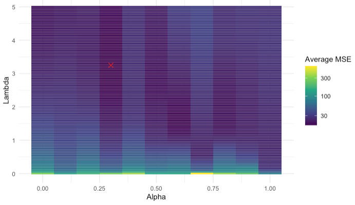
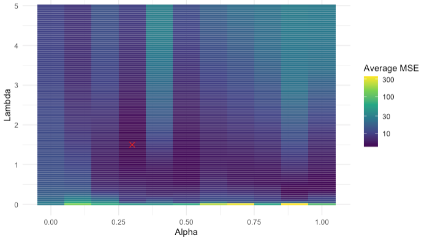
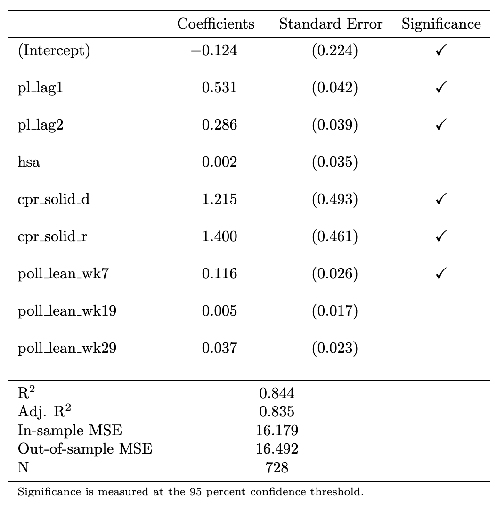
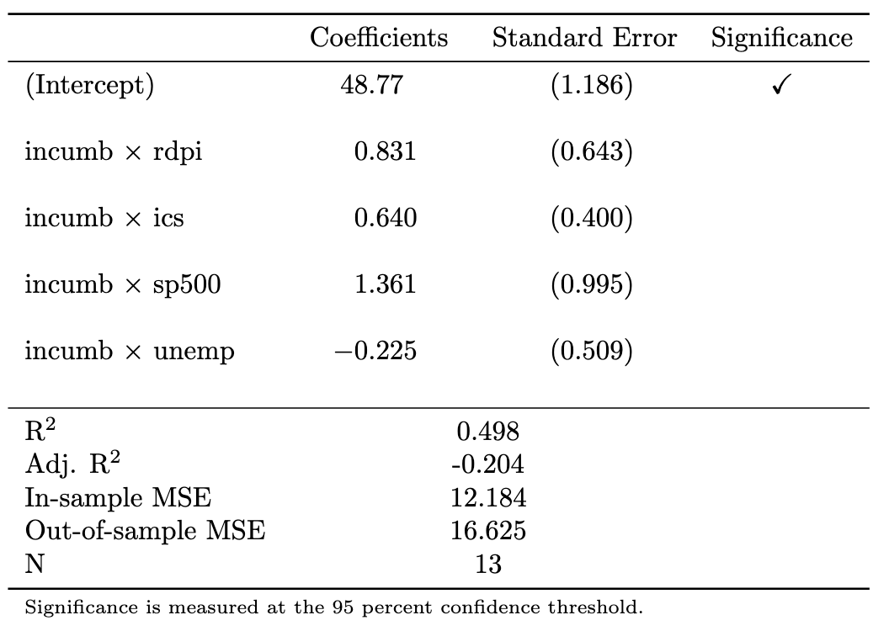
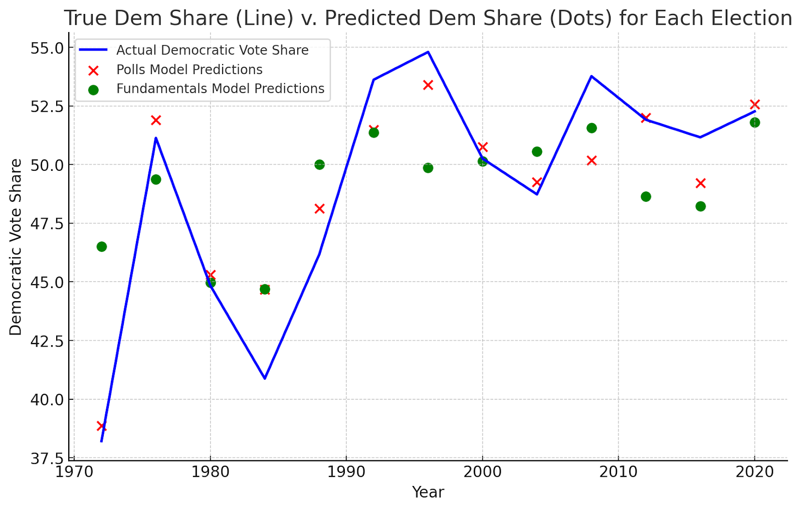

```{r, echo=FALSE, warning=FALSE, message = FALSE}
source("model_construction.R")
df <- read_csv("data/ec_merged_updated_real.csv")
df_econ <- read_csv("data/econ_fundamentals.csv")

indicators <- c("jobs", "pce", "rdpi", "cpi", "ics", "sp500", "unemp")
period_start <- -30
period_end <- -8 #if want 2024, can't set this super close

df <- aggregate_indicators(df, df_econ, indicators, period_start, period_end, rate_aggregation)


# create dataframe subsets
df_subset_1972 <- df %>% filter(year >= 1972)
df_subset_1980 <- df %>% filter(year >= 1980)
df_subset_2000 <- df %>% filter(year >= 2000) 
```

```{r, echo=FALSE, warning=FALSE, message = FALSE}
# define formulas
state_formula <- as.formula(paste("pl_d_2pv ~ pl_d_2pv_lag1 + pl_d_2pv_lag2 + hsa_adjustment +",
                                  "rsa_adjustment + elasticity +", 
                                  "cpr_solid_d + cpr_likely_d	+ cpr_lean_d +", 
                                  "cpr_toss_up + cpr_lean_r + cpr_likely_r	+ cpr_solid_r + ",
                                  paste0("poll_pv_lean_", 7:36, collapse = " + ")))

nat_fund_formula <- as.formula("d_2pv_nat ~ incumb_party:(jobs_agg + 
                                     pce_agg + rdpi_agg + cpi_agg + ics_agg + 
                                     sp500_agg + unemp_agg)")


nat_polls_formula <- as.formula(paste("d_2pv_nat ~ incumb_party:(weighted_avg_approval) + ", 
                                           paste0("poll_pv_nat_", 7:36, collapse = " + ")))

# Split data, using the 1972 subset
state_data <- split_state(df_subset_1972, 2024)
national_data <- split_national(df_subset_1972, 2024)

# Predict state elasticities
state_data$test <- predict_elasticity(state_data$train, state_data$test)

# Train models
state_model_info <- train_elastic_net_fast(state_data$train, state_formula, seed = 123)
nat_fund_model_info <- train_elastic_net_fast(national_data$train, nat_fund_formula, seed = 123)
nat_polls_model_info <- train_elastic_net_fast(national_data$train, nat_polls_formula, seed = 111)
ensemble <- train_ensemble(list(nat_fund_model_info, nat_polls_model_info))

# Make predictions
state_predictions <- make_prediction(state_model_info, state_data$test)
nat_fund_predictions <- make_prediction(nat_fund_model_info, national_data$test)
nat_polls_predictions <- make_prediction(nat_polls_model_info, national_data$test)
# ensemble_predictions <- make_ensemble_prediction(ensemble, national_data$test)

# Create the prediction tibble
df_2024 <- tibble(
  state = state_data$test$state,
  abbr = state_data$test$abbr,
  electors = state_data$test$electors,
  partisan_lean = as.vector(state_predictions$point_estimate),
  partisan_lean_se = as.vector(state_predictions$std_error),
  ) %>%
  # Add national predictions - using first value since they're the same for all states
  mutate(
    d_2pv_polls = first(as.vector(nat_polls_predictions$point_estimate)),
    d_2pv_polls_se = first(as.vector(nat_polls_predictions$std_error)),
    d_2pv_fund = first(as.vector(nat_fund_predictions$point_estimate)),
    d_2pv_fund_se = first(as.vector(nat_fund_predictions$std_error))
 #   d_2pv_ensemble = first(as.vector(ensemble_predictions))
  ) %>%
  # Calculate final margins and color categories
  mutate(
    d_2pv_final = partisan_lean + d_2pv_polls,
    d_pv = d_2pv_final,
    r_pv = 100 - d_2pv_final,
    category = case_when(
      d_pv > 60 ~ "Strong D",
      d_pv > 55 & d_pv < 60 ~ "Likely D",
      d_pv > 50 & d_pv < 55 ~ "Lean D",
      d_pv > 45 & d_pv < 50 ~ "Lean R",
      d_pv > 40 & d_pv < 45 ~ "Likely R",
      TRUE ~ "Strong R"
    ),
    # Convert to factor with specific ordering
    category = factor(
      category,
      levels = c("Strong R", "Likely R", "Lean R", "Lean D", "Likely D", "Strong D")
    ),
    # calculate electors that each party wins
    d_electors = sum(ifelse(category %in% c("Lean D", "Likely D", "Strong D"), electors, 0)),
    r_electors = sum(ifelse(category %in% c("Lean R", "Likely R", "Strong R"), electors, 0))
  ) %>% 
  # filter unnecessary districts
  filter(!abbr %in% c("ME_d1", "NE_d1", "NE_d3"))

write_csv(df_2024, "data/df_2024.csv")
```

```{r, echo=FALSE, warning=FALSE, message = FALSE}
df_ensemble <- read_csv("data/ensemble.csv")
X_ensemble <- df_ensemble %>%
  dplyr::select(y_pred_polls, y_pred_fund) %>%  
  as.matrix()
y_ensemble <- df_ensemble$y_actual
ensemble <- glmnet(x = X_ensemble, y = y_ensemble, lower.limits = 0, intercept = FALSE, lambda = 0)

```

Unfortunately, for this blog, I am largely out of material. This week I have made several touch ups to the raw data files --- I noticed that some population totals were incorrect, as well as some of the voting results in Maine's two districts and Nebraska's three districts. I also replaced the 2024 CPR forecast with their most up-to-date electoral college predictions. Neither of these updates strongly affected my predictions either at the state level or the national level. Also, given Matthew's feedback on my simulation approach, I am largely happy with my results thus far. Consequently, I thought that maybe it would be a good idea to get a jump on my model prediction summary, which means that I can show you all my charts and graphs and so on. This will likely eventually get reused in my final prediction submission, but oh well.

First, here are the specifications:


$$
\mathrm{pl} = \beta_0 + \beta_1 \mathrm{pl\_lag1} + \beta_2 \mathrm{pl\_lag2} + \beta_3\mathrm{hsa} + \beta_4\mathrm{rsa} + \beta_5\mathrm{\epsilon} + \vec{\beta_6}\upsilon + \vec{\beta_7}\chi + \varepsilon
$$

$$
\mathrm{dem\_share\_nat} = \beta_0 + \mathrm{incumb} \times (\beta_1\mathrm{jobs} + \beta_2 \mathrm{pce} + \beta_3\mathrm{rdpi} + \beta_4\mathrm{cpi} + \beta_5\mathrm{ics} + \beta_6\mathrm{sp500} + \beta_7\mathrm{unemp}) + \varepsilon
$$

$$
\mathrm{dem\_share\_nat} = \beta_0 + \beta_1 \mathrm{incumb} \times \mathrm{approval} + \vec{\beta_{2}}\chi + \varepsilon
$$

$$
\mathrm{dem\_share\_nat} = \beta_0 + \beta_1 \mathrm{Model\#1} + \beta_{2}\mathrm{Model\#2} + \varepsilon
$$

Here are the results from the hyperparameter tuning of the elastic net. 

This first one is for the state-level model:

```{r, echo=FALSE, warning=FALSE, message = FALSE}
knitr::include_graphics("fig1.png")
```

The second is for the national-level polls model:

```{r, echo=FALSE, warning=FALSE, message = FALSE}

```

And the third is for the national-level polls model:

```{r, echo=FALSE, warning=FALSE, message = FALSE}

```

Here are the regression results, again, first for the state-level model

```{r, echo=FALSE, warning=FALSE, message = FALSE}

```

For the national-level polls model:

```{r, echo=FALSE, warning=FALSE, message = FALSE}

```

For the national-level fundamentals model:

```{r, echo=FALSE, warning=FALSE, message = FALSE}
knitr::include_graphics("fig6.png")
```

Here is a plot of the residuals for the national-level predictions:

```{r, echo=FALSE, warning=FALSE, message = FALSE}

```

And here is my final prediction for the electoral college:

```{r, echo=FALSE, warning=FALSE, message = FALSE}
electoral_map <- create_electoral_hex_map(df_2024)
electoral_map
```

Finally, my simulation of outcomes:

```{r, echo=FALSE, warning=FALSE, message = FALSE}
# run simulation
election <- simulate_election(df_2024, n_simulations = 100000)

dem_wins <- election %>% summarize(mean(d_ev > r_ev)) %>% pull()
rep_wins <- election %>% summarize(mean(d_ev < r_ev)) %>% pull()

election %>% 
  ggplot() +
    # Smoothed density for Democratic wins
    geom_density(aes(x = d_ev), fill = "lightblue", color = "blue", alpha = 0.3, adjust = 1.5) +
    # Smoothed density for Republican wins
    geom_density(aes(x = r_ev), fill = "lightcoral", color = "red", alpha = 0.3, adjust = 1.5) +
    # Vertical line at 270 electoral votes
    geom_vline(xintercept = 270, linetype = "dashed", color = "black", size = 1) +
    annotate("text", x = Inf, y = Inf, label = paste("Dem Wins:", dem_wins), 
             hjust = 1.1, vjust = 2, size = 6, color = "blue", fontface = "bold") +
    annotate("text", x = Inf, y = Inf, label = paste("Rep Wins:", rep_wins), 
             hjust = 1.1, vjust = 4, size = 6, color = "red", fontface = "bold") +
    # Labels and title
    labs(
      title = "Simulation Results: Electoral Vote Distribution",
      x = "Electoral Votes",
      y = "Density"
    ) +
    # Clean theme for better visualization
    theme_minimal(base_size = 15) +
    theme(legend.position = "none")
```