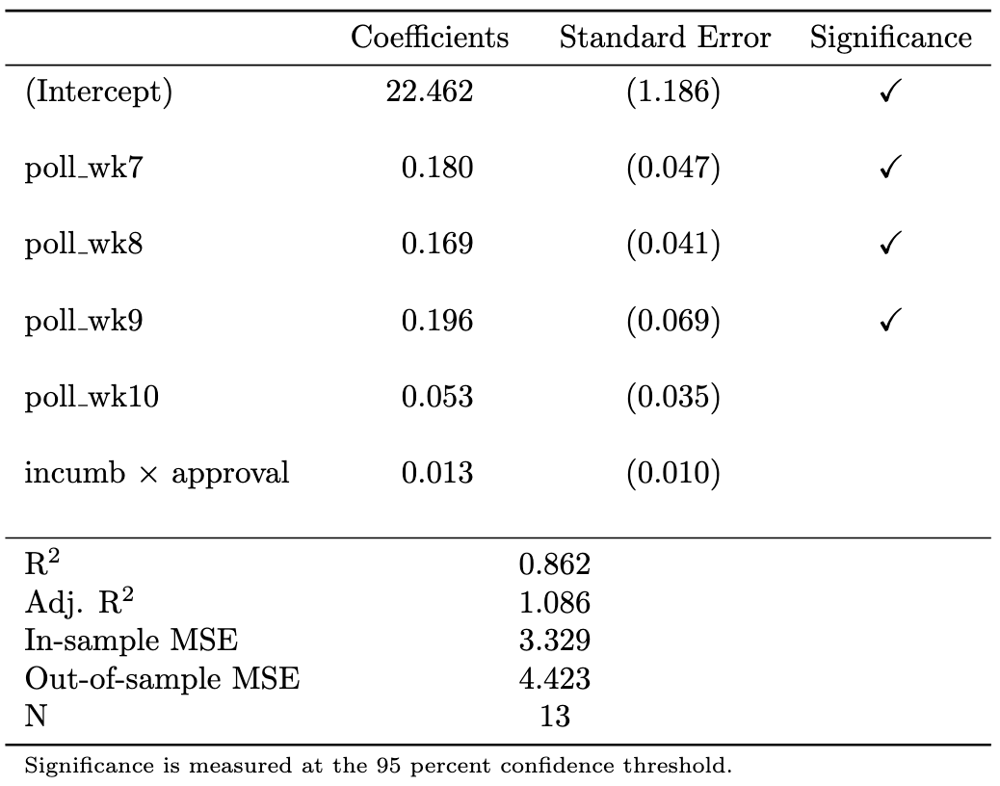

<link href="index_files/htmltools-fill/fill.css" rel="stylesheet" />

<link href="index_files/crosstalk/css/crosstalk.min.css" rel="stylesheet" />

<link href="index_files/plotly-htmlwidgets-css/plotly-htmlwidgets.css" rel="stylesheet" />

Unfortunately, for this blog, I am largely out of material. This week I have made several touch ups to the raw data files — I noticed that some population totals were incorrect, as well as some of the voting results in Maine’s two districts and Nebraska’s three districts. I also replaced the 2024 CPR forecast with their most up-to-date electoral college predictions. Neither of these updates strongly affected my predictions either at the state level or the national level. Also, given Matthew’s feedback on my simulation approach, I am largely happy with my results thus far. Consequently, I thought that maybe it would be a good idea to get a jump on my model prediction summary, which means that I can show you all my charts and graphs and so on. This will likely eventually get reused in my final prediction submission, but oh well.

First, here are the specifications:

$$
\mathrm{pl} = \beta_0 + \beta_1 \mathrm{pl\_lag1} + \beta_2 \mathrm{pl\_lag2} + \beta_3\mathrm{hsa} + \beta_4\mathrm{rsa} + \beta_5\mathrm{\epsilon} + \vec{\beta_6}\upsilon + \vec{\beta_7}\chi + \varepsilon
$$

$$
\mathrm{dem\_share\_nat} = \beta_0 + \mathrm{incumb} \times (\beta_1\mathrm{jobs} + \beta_2 \mathrm{pce} + \beta_3\mathrm{rdpi} + \beta_4\mathrm{cpi} + \beta_5\mathrm{ics} + \beta_6\mathrm{sp500} + \beta_7\mathrm{unemp}) + \varepsilon
$$

$$
\mathrm{dem\_share\_nat} = \beta_0 + \beta_1 \mathrm{incumb} \times \mathrm{approval} + \vec{\beta_{2}}\chi + \varepsilon
$$

$$
\mathrm{dem\_share\_nat} = \beta_0 + \beta_1 \mathrm{Model\#1} + \beta_{2}\mathrm{Model\#2} + \varepsilon
$$

Here are the results from the hyperparameter tuning of the elastic net.

This first one is for the state-level model:

The second is for the national-level polls model:

And the third is for the national-level polls model:

Here are the regression results, again, first for the state-level model

For the national-level polls model:

For the national-level fundamentals model:

Here is a plot of the residuals for the national-level predictions:

And here is my final prediction for the electoral college:

Finally, my simulation of outcomes:

}}index_files/figure-html/unnamed-chunk-12-1.png" width="672" />
