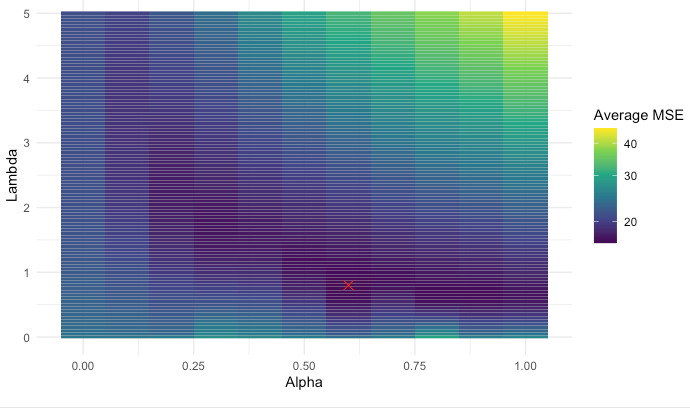
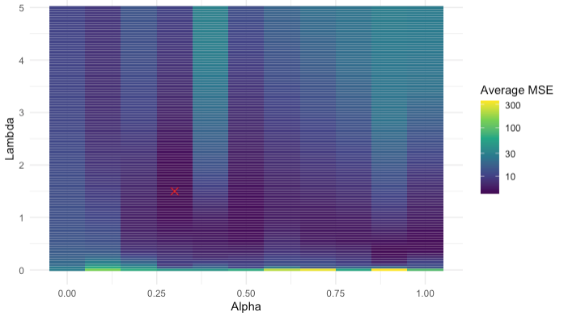
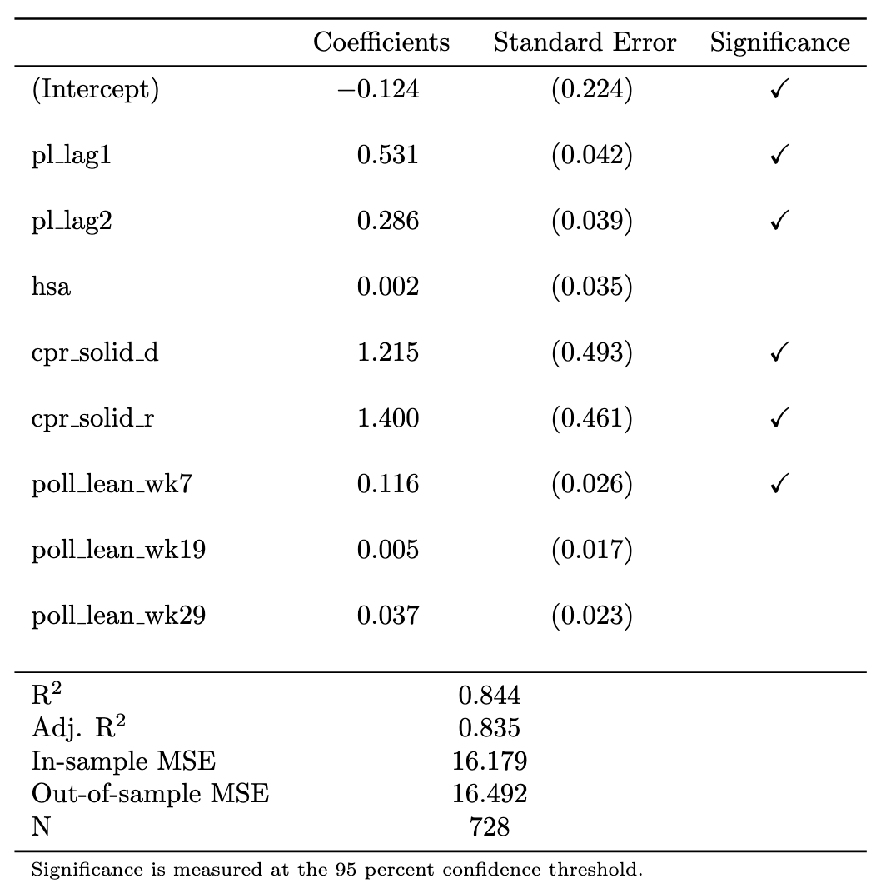
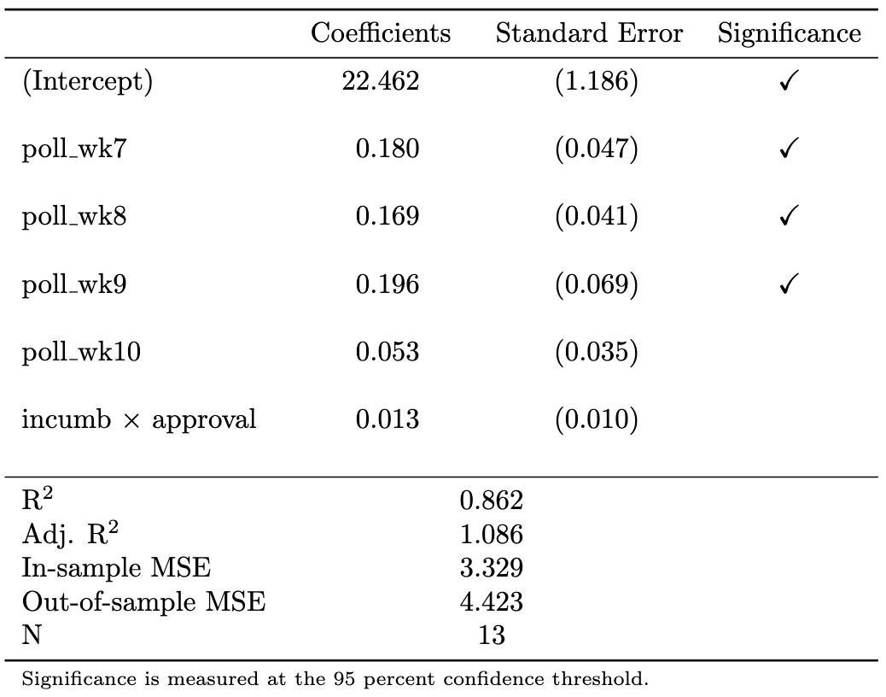
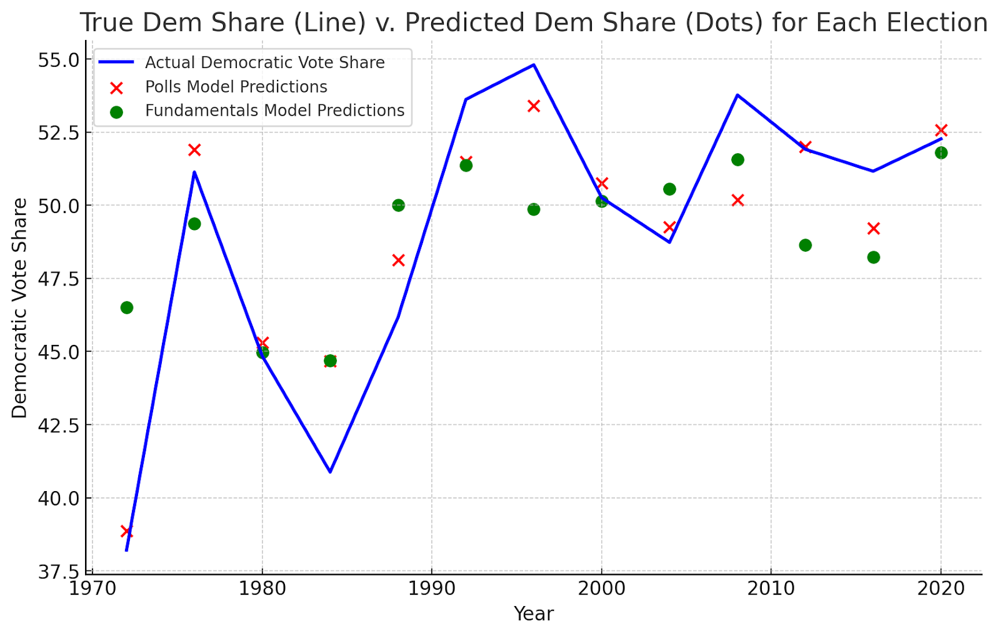

```{r, echo=FALSE, warning=FALSE, message = FALSE}
source("model_construction.R")
df <- read_csv("data/ec_merged_updated_real.csv")
df_econ <- read_csv("data/econ_fundamentals.csv")

indicators <- c("jobs", "pce", "rdpi", "cpi", "ics", "sp500", "unemp")
period_start <- -30
period_end <- -8 #if want 2024, can't set this super close

df <- aggregate_indicators(df, df_econ, indicators, period_start, period_end, rate_aggregation)


# create dataframe subsets
df_subset_1972 <- df %>% filter(year >= 1972)
df_subset_1980 <- df %>% filter(year >= 1980)
df_subset_2000 <- df %>% filter(year >= 2000) 
```

```{r, echo=FALSE, warning=FALSE, message = FALSE}
# define formulas
state_formula <- as.formula(paste("pl_d_2pv ~ pl_d_2pv_lag1 + pl_d_2pv_lag2 + hsa_adjustment +",
                                  "rsa_adjustment + elasticity +", 
                                  "cpr_solid_d + cpr_likely_d	+ cpr_lean_d +", 
                                  "cpr_toss_up + cpr_lean_r + cpr_likely_r	+ cpr_solid_r + ",
                                  paste0("poll_pv_lean_", 7:36, collapse = " + ")))

nat_fund_formula <- as.formula("d_2pv_nat ~ incumb_party:(jobs_agg + 
                                     pce_agg + rdpi_agg + cpi_agg + ics_agg + 
                                     sp500_agg + unemp_agg)")


nat_polls_formula <- as.formula(paste("d_2pv_nat ~ incumb_party:(weighted_avg_approval) + ", 
                                           paste0("poll_pv_nat_", 7:36, collapse = " + ")))

# Split data, using the 1972 subset
state_data <- split_state(df_subset_1972, 2024)
national_data <- split_national(df_subset_1972, 2024)

# Predict state elasticities
state_data$test <- predict_elasticity(state_data$train, state_data$test)

# Train models
state_model_info <- train_elastic_net_fast(state_data$train, state_formula, seed = 123)
nat_fund_model_info <- train_elastic_net_fast(national_data$train, nat_fund_formula, seed = 123)
nat_polls_model_info <- train_elastic_net_fast(national_data$train, nat_polls_formula, seed = 111)
ensemble <- train_ensemble(list(nat_fund_model_info, nat_polls_model_info))

# Make predictions
state_predictions <- make_prediction(state_model_info, state_data$test)
nat_fund_predictions <- make_prediction(nat_fund_model_info, national_data$test)
nat_polls_predictions <- make_prediction(nat_polls_model_info, national_data$test)
# ensemble_predictions <- make_ensemble_prediction(ensemble, national_data$test)

# Create the prediction tibble
df_2024 <- tibble(
  state = state_data$test$state,
  abbr = state_data$test$abbr,
  electors = state_data$test$electors,
  partisan_lean = as.vector(state_predictions$point_estimate),
  partisan_lean_se = as.vector(state_predictions$std_error),
  ) %>%
  # Add national predictions - using first value since they're the same for all states
  mutate(
    d_2pv_polls = first(as.vector(nat_polls_predictions$point_estimate)),
    d_2pv_polls_se = first(as.vector(nat_polls_predictions$std_error)),
    d_2pv_fund = first(as.vector(nat_fund_predictions$point_estimate)),
    d_2pv_fund_se = first(as.vector(nat_fund_predictions$std_error))
 #   d_2pv_ensemble = first(as.vector(ensemble_predictions))
  ) %>%
  # Calculate final margins and color categories
  mutate(
    d_2pv_final = partisan_lean + d_2pv_polls,
    d_pv = d_2pv_final,
    r_pv = 100 - d_2pv_final,
    category = case_when(
      d_pv > 60 ~ "Strong D",
      d_pv > 55 & d_pv < 60 ~ "Likely D",
      d_pv > 50 & d_pv < 55 ~ "Lean D",
      d_pv > 45 & d_pv < 50 ~ "Lean R",
      d_pv > 40 & d_pv < 45 ~ "Likely R",
      TRUE ~ "Strong R"
    ),
    # Convert to factor with specific ordering
    category = factor(
      category,
      levels = c("Strong R", "Likely R", "Lean R", "Lean D", "Likely D", "Strong D")
    ),
    # calculate electors that each party wins
    d_electors = sum(ifelse(category %in% c("Lean D", "Likely D", "Strong D"), electors, 0)),
    r_electors = sum(ifelse(category %in% c("Lean R", "Likely R", "Strong R"), electors, 0))
  ) %>% 
  # filter unnecessary districts
  filter(!abbr %in% c("ME_d1", "NE_d1", "NE_d3"))

write_csv(df_2024, "data/df_2024.csv")
```

```{r, echo=FALSE, warning=FALSE, message = FALSE}
df_ensemble <- read_csv("data/ensemble.csv")
X_ensemble <- df_ensemble %>%
  dplyr::select(y_pred_polls, y_pred_fund) %>%  
  as.matrix()
y_ensemble <- df_ensemble$y_actual
ensemble <- glmnet(x = X_ensemble, y = y_ensemble, lower.limits = 0, intercept = FALSE, lambda = 0)

```

## Overview

Election week has come! It is a very scary time. We are all biting our nails in anticipation of the result on Tuesday and, of course, in anticipation of the predictions from the Election Analytics class. This entire semester, I have been developing a three-stage model that predicts the election results, and I am excited to provide a brief overview of my methodology, as well as my final predictions and simulations.

First, let me just provide a brief overview of how the overall prediction itself works. There are four models in total: two models that predict the national-level vote share of the Democratic candidate (i.e. the Democratic popular vote) --- each using a different set of data --- one model that predicts the state-level vote shares of the Democratic candidate (i.e. the electoral college), and one final model that ensembles the two national-level vote shares.

All four of these submodels are "elastic net" regressions. These are quite similar to simple linear regressions, in which coefficients are computed using Ordinary Least Squares, except that there is a penalty term added to shrink the values of each coefficient. The elastic net also has the benefit of automatically conducting feature selection, which means that predictors that do not contribute to reducing the overal varince get zeroed out.

## The Fundamentals Model

The first popular vote model uses "economic fundamentals," which are economic indicators that describe the state of the economy in the lead-up to the election, to predict the national-level Democratic vote share. Here is a list of the economic indicators that I used:
- Total non-farm jobs
- Personal consumption expenditure
- Real disposable personal income
- Inflation, as measured by the annual change in the Consumer Price Index
- The stock market, based on the closing value of the S&P 500
- The consumer sentiment index calculated by the University of Michigan
- The unemployment rate

The above variables provide a cohesive snapshot of the economy at any given point in time. The most important contribution here is the inclusion of consumer sentiment --- a variable that many forecasters have not examined in the past. The reason I include it is because recently, consumer sentiment about the economy --- i.e. how people think the economy is doing --- is drastically different from the actual state of the economy (Radcliffe et. al. (2024)). There are many explanations for this “sentiment gap.” Perhaps its because of the recent interest rate hikes that increase the cost of borrowing (Summers et. al. (2024)). Perhaps it’s because the period from February 2021 to June 2022 was the first time consumers in the United States experienced prolonged high levels of inflation since the 1990s, after the oil price shock in response to Iraq’s invasion of Kuwait. Regardless, this divergence suggests that traditional economic indicators may not entirely capture voters’ underlying behavior, because they may have a warped understanding of the economy.

The reason that I create a fundamentals forecast at all is because several prominent political science papers have noticed that economic strength in the leadup to the election appears to be a fairly strong predictor of incumbent performance (see e.g. Achen and Bartels (2017)). The intuition for this is that voters may credit or blame the current leadership for the state of the economy, even when many economic factors are outside direct political control.

Two interesting methodological choices that I made in the fundamentals model are a) the method of data aggregation and b) the timeframe of aggregation. Most of these economic indicators are reported weekly since 1948. Given that presidential elections occur only once every four years, we therefore need some way to collapse all the data for a given cycle into a single observation. There are two main ways to do this: "rate aggregation" and "mean aggregation." Rate aggregation measures the percent change in a given indicator between time $t_1$ and time $t_2$. Mean aggregation measures the average value of an indicator for all observations between time $t_1$ and time $t_2$. Both aggregation measures have their advantages, but I ultimately decided on rate aggregation. Because memory is short, opinions about the economy are likely better reflected based on the change in economic conditions, rather than the level.

There is also the question of the aggregation timeframe. Several classic models --- like the "time for change" model --- use quarter two of the election year as the timeframe (Abramowicz (2008)). However, I thought that this selection was a bit arbitrary, so I looped through all possible values of $t_1$ and $t_2$ and selected the time period that reduced the overall error of the model. Eventually, I settled on a period from 30 weeks out from the election to 8 weeks out from the election.

Importantly, because each of the variables affect the _incumbent_, and the dependent variable in my model is the _democratic vote share_, I needed to interact each economic indicator with a dummy variable for incumbency that equals $+1$ if the Democratic party is the incumbent party and $-1$ if the Republican party is the incumbent party.

## The Polls Model

In addition to the fundamentals model, I also used a model based on national-level polling data and the incumbent's approval rating. For this model, I included a variable for the national polling average (published by 538) each week prior to the election from 30 weeks prior to the election up until election week.

The most interesting methodological decision here is actually how to calculate the approval rating. Like the economic indicators, there is a big question about how to aggregate this metric. Rather than doing change over time, though, for this metric I instead used a weighted average, where the approval ratings closer to the election were given greater weight than the older approval ratings. The weighting is performed using an exponential decay function, $a = e^{-kw}$, where $w$ is the number of weeks out from the election and $k$ is a parameter set to $0.01$.

Also, like the economic variables in the fundamentals model, the approval rating variable only predicts the electoral success of the incumbent, not of the Democratic Party specifically. As such, I interact the approval rating with the same incumbency dummy as above.

## The electoral college model

Next, let's examine the electoral college model. Importantly, this model does not directly predict the Democratic vote share in each state. Rather, it predicts a metric called "partisan lean," which measures how much more or less democratic a given state is than the national popular vote. So, for example, if the popular vote is $52\%$ for the Democratic candidate and Alabama has a partisan lean of $-20$, then the Democratic vote share in Alabama is $32\%$. Clearly, though, it is easy to convert from partisan lean to vote share once a national popular vote prediction is calculated.

Unlike in the national model, in the polls model I did not separate out into fundamentals and polls --- largely because I did not believe that local-level economic fundamentals would be particularly predictive of local vote share. The literature has found that national-level economic variables tend to be more predictive than local ones.

As a result, I only used a single model for the electoral college, which includes the following variables:
- A state's partisan lean in the previous election cycle
- A state's partisan lean two election cycles prior
- Home state advantage
- Resident state advantage
- A state's elasticity
- The Cook Political Report prediction for a given state
- The polling lean for a given state 

The first two variables are autoregressive. The thing that best predicts partisan lean in the current election is vote share in he previous election. The third and fourth variables are dummy variables that are non-zero if a candidate was born in a given state or currently resides in a given state.

The fifth variable, elasticity, is a measure of how variable a given state is over time. If a state votes very Democratic in one election but very Republican in the next, it would have a very high elasticity.

The sixth variable --- which is actually a vector of variables --- indicates the rating that the Cook Political Report gave that state. The Cook Political Report consists of a set of a experts that publishes regular election forecasts. The forecast for a state is one of "Solid R," "Likely R," "Lean R," "Toss Up," "Lean D," "Likely D," or "Solid D."

The seventh variable is also a vector of variables consisting of the polling for a given state. This is the same as the polling in the popular vote model --- one variable for the polling data each week in the lead up to the election --- with one notable exception: the value of each variable is not the poll itself, but rather the _poll lean_, which is the difference between that week's state-level polling average and that week's national-level polling average.

Finally, in my electoral college prediction, I include the fact that Maine and Nebraska split their electoral votes. They each allocate two electoral votes to the winner of the state’s popular vote. Then, they allocate one electoral vote to the popular vote winner in each congressional district. Thus, in total, my forecasts predicts vote margin in 54 jurisdictions: the two congressional districts in Maine, the three congressional districts in Nebraska, the other 48 states, and Washington D.C.

## The ensemble model

The fourth and final model is simply a way of aggregating the two popular vote predictions. It is a linear regression that uses the vote share predictions from the two national models as regressors on the actual historical vote share. The coefficients for this model are also not calculated with OLS. Instead, the optimization is constrained so that the coefficients cannot be negative and that they must sum to $1$. After all, the interpretation of the coefficient is that they are relative weights for each of the two popular vote models.

In all, here are the four regression specifications all laid out at once:

$$
\mathrm{pl} = \beta_0 + \beta_1 \mathrm{pl\_lag1} + \beta_2 \mathrm{pl\_lag2} + \beta_3\mathrm{hsa} + \beta_4\mathrm{rsa} + \beta_5\mathrm{\epsilon} + \vec{\beta_6}\upsilon + \vec{\beta_7}\chi + \varepsilon
$$

$$
\mathrm{dem\_share\_nat} = \beta_0 + \mathrm{incumb} \times (\beta_1\mathrm{jobs} + \beta_2 \mathrm{pce} + \beta_3\mathrm{rdpi} + \beta_4\mathrm{cpi} + \beta_5\mathrm{ics} + \beta_6\mathrm{sp500} + \beta_7\mathrm{unemp}) + \varepsilon
$$

$$
 \mathrm{dem\_share\_nat} = \beta_0 + \beta_1 \mathrm{incumb} \times \mathrm{approval} + \vec{\beta_{2}}\chi + \varepsilon
$$

$$
\mathrm{dem\_share\_nat} = \beta_0 + \beta_1 \mathrm{Model\#1} + \beta_{2}\mathrm{Model\#2} + \varepsilon
$$

## Simulation

Once my models are trained, I am able to produce point estimates for the national Democratic popular vote as well as for all 54 jurisdictions in my electoral college model. They point estimates are the most likely result, but there is also some uncertainty on either side of the prediction. To quantify the spread of this uncertainty, I calculate the “standard error of the prediction,” otherwise known as the “forecast variance.” The math behind the forecast variance is a bit tricky to parse. But it essentially amounts to the sum of the variance in the measurement error plus the sum of the variance in the predictions.

Once I have a meausure of the variance of each prediction, I can then create hypothetical distributions for the election result in each jurisdiction. I assume that vote shares are normal random variables with means equal to the point estimates that my model spit out and variances determined by the forecast variance. Then, I can create a giant multinomial distribution where I can take 100,000 sample draws from all 54 jursidictions, plus the national popular vote, at once.

Then, for each draw, I calculate the total number of electors each candidate won.

## Results

Here are the results from my four models, listed above. First, take a look at the results from the hyperparameter tuning of the elastic net. 

This first one is for the state-level model:

```{r, echo=FALSE, warning=FALSE, message = FALSE}

```

The second is for the national-level polls model:

```{r, echo=FALSE, warning=FALSE, message = FALSE}
knitr::include_graphics("fig2.png")
```

And the third is for the national-level polls model:

```{r, echo=FALSE, warning=FALSE, message = FALSE}

```

Now, here are the regression results for the state-level model,
```{r, echo=FALSE, warning=FALSE, message = FALSE}

```

For the national-level polls model:

```{r, echo=FALSE, warning=FALSE, message = FALSE}
knitr::include_graphics("fig5.png")
```

And for the national-level fundamentals model.

```{r, echo=FALSE, warning=FALSE, message = FALSE}

```

Note that in the national fundamentals model, many of the economic indicators were dropped by the elastic net, but the index of consumer sentiment remained. This suggests that my hypothesis was right: maybe we should be focusing more on consumer sentiment at this point in time, given that it has diverged from the ground truth of the economy.

Here is a plot of the residuals for the national-level predictions, for both the polls model and the fundamentals model. This measures the difference between my predicted values for popular vote and the actual popular vote levels.

```{r, echo=FALSE, warning=FALSE, message = FALSE}

```

Note that the polls did a much better job on the whole of predicting national popular vote. This makes sense: economic fundamentals are incredibly noisy, and we likely don't have a large enough sample size of elections in order to distinguish signal from noise. Consistent with this fact, it is notable that the ensemble model actually calculated weights such that the polls model received 100 percent of the weight, whereas the fundamentals model received 0 percent. Thus, the "national level predictions" are functionally just the popular vote predictions from my polls.

While this result initially surprised me, given that a lot of folks assert that economic fundamentals are so central to election outcomes, it turns out that it is largely consistent with 538's weights --- which are 97 percent in favor of the polls model and just 3 percent in favor of the fundamentals.

Here is my final prediction for the electoral college:

```{r, echo=FALSE, warning=FALSE, message = FALSE}
electoral_map <- create_electoral_hex_map(df_2024)
electoral_map
```

Finally, my simulation of outcomes:

```{r, echo=FALSE, warning=FALSE, message = FALSE}
# run simulation
election <- simulate_election(df_2024, n_simulations = 100000)

dem_wins <- election %>% summarize(mean(d_ev > r_ev)) %>% pull()
rep_wins <- election %>% summarize(mean(d_ev < r_ev)) %>% pull()

election %>% 
  ggplot() +
    # Smoothed density for Democratic wins
    geom_density(aes(x = d_ev), fill = "lightblue", color = "blue", alpha = 0.3, adjust = 1.5) +
    # Smoothed density for Republican wins
    geom_density(aes(x = r_ev), fill = "lightcoral", color = "red", alpha = 0.3, adjust = 1.5) +
    # Vertical line at 270 electoral votes
    geom_vline(xintercept = 270, linetype = "dashed", color = "black", size = 1) +
    annotate("text", x = Inf, y = Inf, label = paste("Dem Wins:", dem_wins), 
             hjust = 1.1, vjust = 2, size = 6, color = "blue", fontface = "bold") +
    annotate("text", x = Inf, y = Inf, label = paste("Rep Wins:", rep_wins), 
             hjust = 1.1, vjust = 4, size = 6, color = "red", fontface = "bold") +
    # Labels and title
    labs(
      title = "Simulation Results: Electoral Vote Distribution",
      x = "Electoral Votes",
      y = "Density"
    ) +
    # Clean theme for better visualization
    theme_minimal(base_size = 15) +
    theme(legend.position = "none")
```


Note that the simulation distributions are, of course, symmetric. Also note that the mode of the distribution actually occurs at a point where Harris loses the overall election. This is counterbalanced by the multitude of simulations where she wins over 300 electoral colelge votes. 

my simulations are quite similar to those of 538. It is interesting that my standard errors are so large --- nearly 6 points at times, which suggests a confidence interval of over 20 points in size --- but it matches what Elliott Morris calculated, so I suppose I am doing something correct.


