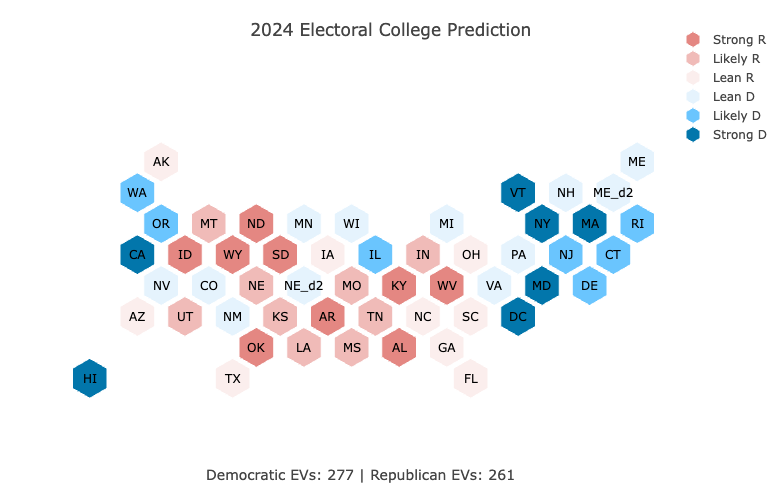
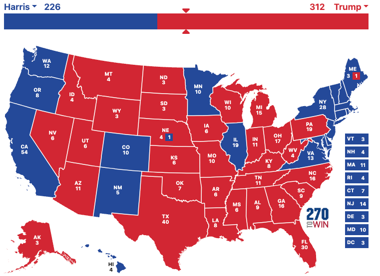
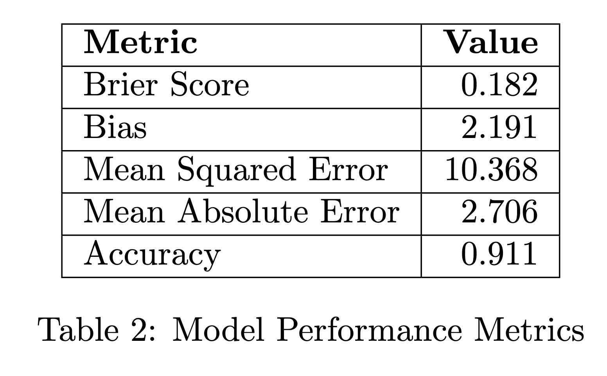

```{r, echo=FALSE, warning=FALSE, message = FALSE}
source("model_construction.R")

df_2024 <- read_csv("data/df_2024_predictions.csv")
results_2024 <- read_csv("data/state_votes_pres_2024.csv")
```

```{r}

# merge shit in and format the dataframe
df_2024 <- df_2024 %>% 
  left_join(results_2024, by = "state") %>% 
    mutate(
    d_pv_actual = (d_votes / (d_votes + r_votes)) * 100,
    r_pv_actual = (r_votes / (d_votes + r_votes)) * 100,
    binary_pred = ifelse(d_pv > r_pv, 1, 0),
    binary_actual = ifelse(d_pv_actual > r_pv_actual, 1, 0)
  ) %>% 
  rename(
    d_pv_pred = d_pv,
    r_pv_pred = r_pv
  ) %>% 
  relocate(c("d_pv_pred", "d_pv_actual", "binary_pred", "binary_actual"), .after = "electors") %>% 
  # Add prediction metrics
  group_by() %>%  
  mutate(
    brier_score = mean(((d_pv_pred / 100)- binary_actual)^2),
    bias = mean(d_pv_pred - d_pv_actual),
    mse = mean((d_pv_pred - d_pv_actual)^2),
    mae = mean(abs(d_pv_pred - d_pv_actual)),
    accuracy = mean(binary_pred == binary_actual)
  ) %>%
  ungroup()


view(df_2024)
```

The election is over. Trump has won. Now we must mourn our dead... and evaluate our model. This will be a comparatively shorter post, just because there simply isn't that much to say. As a reminder, here is the map that I predicted in the final days before the election:

```{r}

```


And here is the actual map:

```{r}

```

Here are the predictions that I missed:
- Wisconsin
- Michigan
- Pennsylvania
- Maine District 2
- Nevada

All of these predictions were biased toward the Democrats. In other words, I thought Harris would win those states, but Trump actually won them.

Now, let's evaluate the performance of my model more concretely. For this, I will only be measuring the accuracy of my state-level predictions, because the national popular vote still hasn't been fully tabulated.

Please see the below table:
```{r}

```
Let's go through each statistic one-by-one and unpack what it means.

First, the Brier Score. This is a measure of the accuracy of my probabilistic predictions. In other words, how well does my probabilistic forecast measure what actually happened? For example, suppose I predict a 90 percent chance of democratic victory in a given state, and then the Democratic candidate ends up winning. Then my Brier score is $(0.9 - 1)^2 = 0.01$, which is very good. But if it turns out that the Democratic candidate loses, my Brier score is $(0.9 - 0)^2 = 0.81$, which is very bad. A lower score is better. Thus, my score of 0.182 suggests reasonably good probabilistic predictions, though there was some miscalibration in my confidence levels.

One thing that is important to note: Brier scores may not be the best metric to measure accuracy in this particular case. This is because my vote share predictions are not actually probabilistic. I.e. if I predict that Harris wins 54 percent of the vote, I am not saying that she wins the state 54 percent of the time. In fact, it is likely that if my model spits out a 54 percent vote share that she wins singificantly more often than 54 percent of the time. In order to get a probabilistic forecast, I would have to run simulations on each individual state.

Second, the Bias. This indicates your model had a systematic overestimation of about 2.19 percentage points in favor of Democratic vote share across states. In other words, on average, your model predicted Democratic candidates would do better than they actually did by about 2.2 points. Interestingly, this is consistent with the bias in the polling error for the Democrats. On average, the polls were biased by a touch over 2 points toward the Democrats. Without this polling bias, my model would have likely performed signficantly better.

Third, Mean Absolute Error. This is fairly straightforward: On average, my predictions for the Democratic two-party vote share were off by about 2.7 percentage points in either direction.

Fourth, Mean Squared Error (10.368): MSE penalizes larger errors more heavily than small ones by squaring the differences. A value of 10.368 means my typical vote share prediction was off by about $\sqrt(10.368) = 3.22$  percentage points, but this average includes some predictions that were further off (which got penalized more heavily in the calculation).

Accuracy: If we treat my election as a binary classification problem (predicting whether Democrats won each state or not), my model correctly predicted the winner in about 91.1 percent of states. The states I got wrong are listed above. 

Overall, these metrics suggest my model was quite good at predicting winners, but had a consistent Democratic bias and was typically off by about 2-3 percentage points in its exact vote share predictions.

